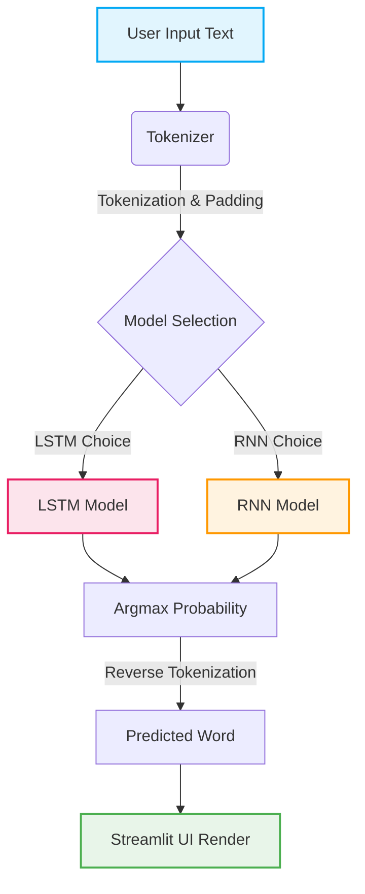

<div align="center">
  <h1>🔮 Next Word & Sentence Predictor</h1>
  <p><strong>A Deep Learning powered application to intelligently predict the next sequence of text using LSTM and RNN architectures.</strong></p>
  
  <p>
    
    
    
    
  </p>
</div>

---

## 📖 Overview

The **Next Word Predictor** is an interactive web application built with Streamlit that utilizes pre-trained Deep Learning models to predict subsequent words based on user input. It allows users to seamlessly switch between two distinct sequence modeling architectures: **LSTM** (Long Short-Term Memory) and **RNN** (Recurrent Neural Network), while providing flexibility to predict either a single word or an entire sentence completion.

## ✨ Features

- 🧠 **Dual Model Support**: Switch seamlessly between LSTM and RNN models.
- 🎯 **Task Selection**: Choose to predict the exact next word or generate a multi-word phrase.
- 🎨 **Beautiful UI**: Modern, clean, and responsive user interface powered by Streamlit and custom CSS.
- ⚡ **Real-Time Generation**: Highly optimized prediction flow caching the models and tokenizers in memory.

---

## 🏗️ Architecture

Below is the computational flow from when a user enters text to when the prediction is rendered on the screen:



---

## 🛠️ Technology Stack

| Component | Technology | Description |
| :--- | :--- | :--- |
| **Frontend** | Streamlit | Provides the reactive user interface and component logic. |
| **Core ML** | TensorFlow & Keras | Houses the LSTM and RNN model architectures. |
| **Data Ops** | NumPy | Facilitates fast array operations and argmax probabilities. |
| **Serialization**| Pickle | Used to load the fitted tokenizers and config payloads. |

---

## 🚀 Installation & Setup

We provide instructions for both standard `pip` and the ultra-fast `uv pip` package managers. Please choose the one that fits your workflow.

### 🚩 Option A: Standard Setup (Using `pip`)
*Use this method if you are using standard Python tools.*

```bash
# 1. Create a virtual environment
python -m venv venv

# 2. Activate the virtual environment
# On Windows:
.\venv\Scripts\activate
# On macOS/Linux:
source venv/bin/activate

# 3. Install the required dependencies
pip install -r requirements.txt
```

### 🚩 Option B: Ultra-Fast Setup (Using `uv`)
*Use this method if you have `uv` installed for significantly faster dependency resolution.*

```bash
# 1. Create a virtual environment with uv
uv venv venv

# 2. Activate the virtual environment
# On Windows:
.\venv\Scripts\activate
# On macOS/Linux:
source venv/bin/activate

# 3. Install dependencies blazingly fast
uv pip install -r requirements.txt
```

---

## 💻 Running the Application

Once your virtual environment is active and dependencies are installed, you can launch the app by running:

```bash
streamlit run app.py
```

Open your browser and navigate to the Local URL provided in your terminal (typically `http://localhost:8501`).

---

<div align="center">
  <i>Developed and maintained by <a href="https://github.com/Rohit-more-05">Rohit</a>.</i>
</div>
